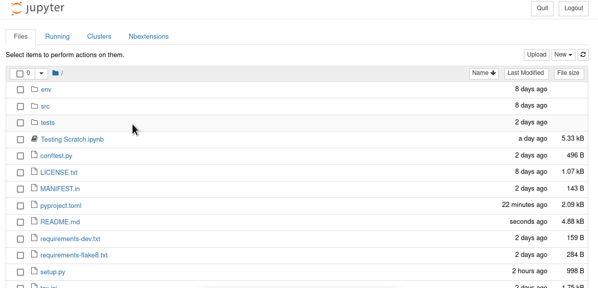
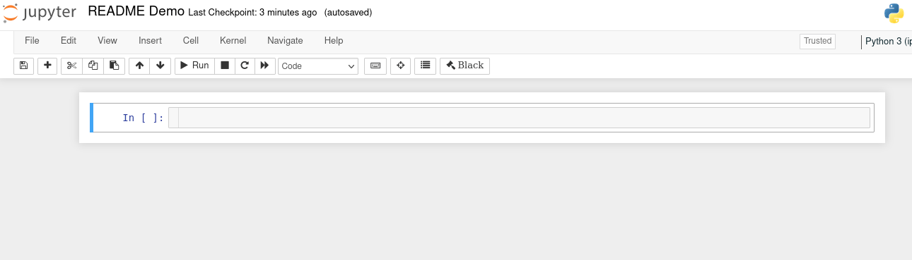
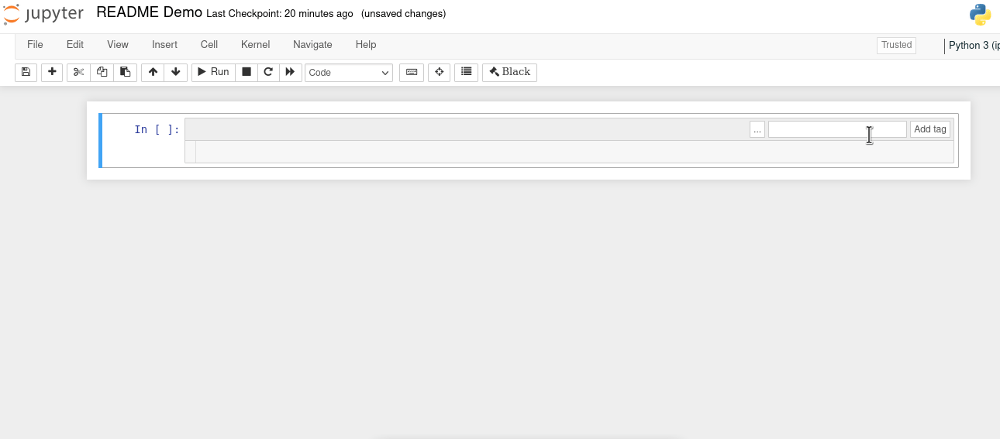
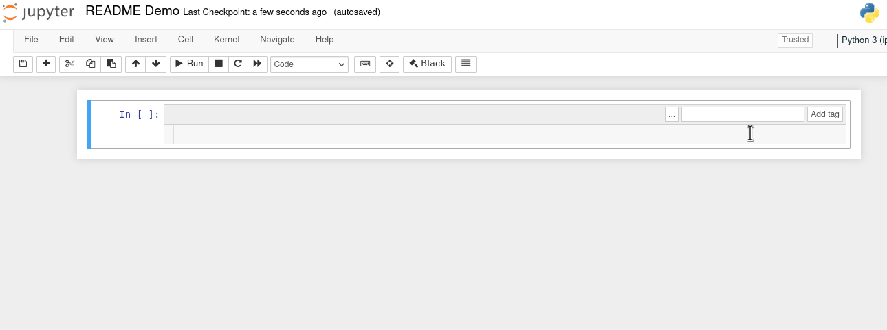
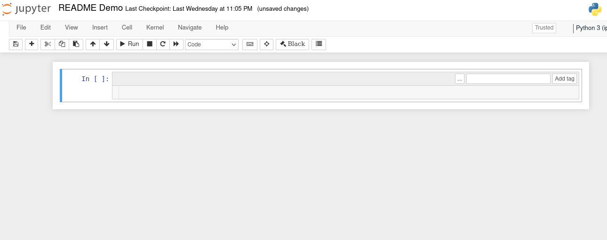
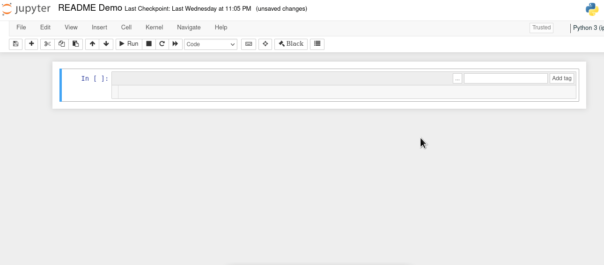
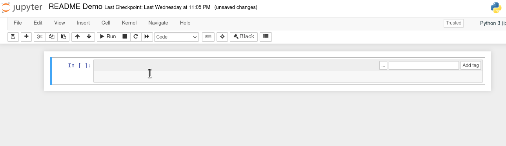

# jupyter-tempvars: Convenient temporary variable management in Jupyter Notebook

### Most Recent Stable Release:

[](https://pypi.org/project/jupyter-tempvars)


### Info:

[](https://github.com/bskinn/jupyter-tempvars/blob/stable/LICENSE.txt)

[](https://github.com/psf/black)

**Do you work in Jupyter Notebook?**

**Are your notebooks flaky sometimes, due to leftover/temporary variables?**

`jupyter-tempvars` can help!

Namespace pollution with leftover/temporary variables is a
common challenge of using Jupyter notebooks. It's a downside
of the power provided by the shared global notebook namespace,
for things like exploratory data analysis.

And, it can be a pretty big downside. It's quite annoying
to work for hours to try to figure out what's wrong with a notebook,
only to have it suddenly work properly when you restart Jupyter.
It's also quite annoying to have a workbook that you *thought*
was working correctly, suddely *stop* working once you restart.
It can cause even bigger problems if you pass a notebook
on to someone else, and then it doesn't work right for them even
though it was working fine for you.

`jupyter-tempvars` is a Jupyter nbextension built on the
[`tempvars` Python package](https://github.com/bskinn/tempvars)
that helps minimize these kinds of problems. Simply decorate code
cells with metadata tags matching a defined template, and then variables
that fit the rules you define will be automatically treated
as temporary variables. This means that:

 1. Matching variables will be removed from the global namespace before
    each tagged cell is executed, ensuring that cell isn't contaminated
    by "dragged-in" variables, ***and***

 2. Matching variables will be removed from the global namespace after the cell has
    finished executing, ensuring that other code cells aren't contaminated by
    this cell, either.

As `jupyter-tempvars` is currently configured, any variables removed
from the global namespace before execution of the cell are *restored*
to the global namespace after execution is finished.


## Prerequisites

### Python

I've been developing `jupyter-tempvars` using Python 3.9, but I believe any
version of Python 3 that works with the underlying `tempvars` library
(which should be all actively maintained versions, 3.7+) should work fine.
It should work on any platform supported by Jupyter.
(At some point soon here, I'll be figuring out a test suite to actually
check across platforms and Pythons....)

### Jupyter

`jupyter-tempvars` requires a full instance of [Jupyter Notebook](https://jupyter.org/),
including the Javascript frontend. So far, I've only tested it with vanilla Jupyter,
but in theory I think it should work with JupyterHub, Jupyter in Anaconda, etc.
I would be grateful for feedback from anyone who tries to use it in
other contexts. I believe it should work with `notebook` versions 4.x and above.
Note that `jupyter-tempvars` will **NOT** work with JupyterLab!

To get a basic Jupyter install just `pip install jupyter`.

### `jupyter-contrib-nbextensions`

The community-developed
[`jupyter-contrib-nbextensions` package](https://github.com/ipython-contrib/jupyter_contrib_nbextensions)
is not strictly required in order to use `jupyter-tempvars`, but it's highly recommended.
If nothing else, the configurator plugin that adds a `Nbextensions` tab to the
main Jupyter interface is really handy. See the install instructions
[here](https://jupyter-contrib-nbextensions.readthedocs.io/en/latest/install.html).


## Installation

The first step is to install the overall `jupyter-tempvars` package.
It's on PyPI, so just:

```
$ pip install jupyter-tempvars
```

From there, the `jupyter_tempvars` extension needs to be installed into the
Jupyter environment itself. The `juypter-tempvars` project ships with a
helper script to simplify the most common case, where the extension is
installed into the user-scope extension registry:

```
$ jupyter-tempvars install
```

Now that the extension is installed, it needs to be activated,
either in the `Nbextensions` Jupyter tab of the configurator:

<kbd><a href="media/enable_extension.gif"></a></kbd>

or by running the helper script with the `enable` command:

```
$ jupyter-tempvars enable
```

Again, note that the `jupyter-tempvars` helper script is set up to install the extension
to the user's Jupyter extension repository (`--user` flag to `jupyter nbextension`).
If you wish to install to a different location, you'll need to invoke the necessary
`jupyter nbextension` commands manually.


## Upgrading

Upgrading the extension after it's been installed also has two steps:

```
$ pip install --upgrade jupyter-tempvars tempvars
$ jupyter-tempvars install
```

It's important to also upgrade `tempvars` whenever you upgrade
`jupyter-tempvars`, in case the extension needs features
from a newer version of `tempvars`.

If you pin `jupyter-tempvars` to a specific version using `pip freeze`,
or with a tool like `poetry` or `pipenv`, you should make sure
that the pins for both `tempvars` and `jupyter-tempvars` get updated.


## Usage

As of v0.1, `jupyter-tempvars` supports two filters for identifying
temporary variables, a 'starts with' filter and an 'ends with' filter.
Both methods use the built-in Jupyter capability to attach metadata to
individual notebook cells.

The first step to use `jupyter-tempvars` is to display the
`Tags` metadata cell headers, if they're not already visible:

1. Open an `.ipynb` notebook.
2. In the toolbar, click `View` > `Cell Toolbar` > `Tags`

<kbd><a href="media/show_cell_tags.gif"></a></kbd>

Then, for each cell you want `jupyter-tempvars` to handle temporary
variables, add a tag to that cell with one of the following two formats:

- To treat all variables starting with a given prefix as temporary,
  use `tempvars-start-{prefix}`

- To treat all variables ending with a given suffix as temporary,
  use `tempvars-end-{suffix}`

So, for example, to treat all variables in a cell that start with `t_`
as temporary variables, tag the cell with `tempvars-start-t_`:

<kbd><a href="media/tempvars_start_demo.gif"></a></kbd>

Similarly, to treat all variables that end with `_temp` as temporary,
tag the cell with `tempvars-end-_temp`:

<kbd><a href="media/tempvars_end_demo.gif"></a></kbd>

The `tempvars-` tags can be used multiple times, and in combination with each other:

<kbd><a href="media/tempvars_multiple_demo.gif"></a></kbd>

Temporary variables are also cleared from the namespace before executing the tagged cell:

<kbd><a href="media/tempvars_clear_on_start.gif"></a></kbd>

The traceback in the above example also reveals how `jupyter-tempvars`
works under the hood: the cell's code is enclosed with a
[`tempvars.TempVars`](https://tempvars.readthedocs.io/en/latest/api.html#tempvars.TempVars)
context manager (imported to the notebook namespace as `_TempVars`)
before submission to the kernel for execution. One side effect
of this implementation is that the result of the last line of the code is not
echoed to output for tagged cells, and must be explicitly `print`-ed:

<kbd><a href="media/tempvars_print_needed.gif"></a></kbd>

As noted above, `jupyter-tempvars` currently restores pre-existing temporary variables,
cleared before the start of tagged cell execution, *back* to the global namespace
after execution has completed. If it would be valuable to allow the option of
*not* restoring the pre-existing variables after execution of a tagged cell,
please comment [here](https://github.com/bskinn/jupyter-tempvars/issues/21).
More generally, bug reports and feature requests of any kind for both
[`jupyter-tempvars`](https://github.com/bskinn/jupyter-tempvars/issues) and the underlying
[`tempvars`](https://github.com/bskinn/tempvars/issues) library are always welcome.


## Advanced Variable Management via `tempvars`

`jupyter-tempvars` only exposes a subset of the functionality
provided by the underlying `tempvars` Python package. If you need
a more powerful temporary variable
management tool, take a look at the
[full capabilities](https://tempvars.readthedocs.io/en/latest/usage.html) of `tempvars`.

`jupyter-tempvars` also requires the full Jupyter notebook frontend to function.
If you want to manage temporary variables when using a tool that
interacts with notebooks outside the context of the Jupyter frontend (e.g.,
[`nbclient`](https://github.com/jupyter/nbclient) or
[`nbmake`](https://github.com/treebeardtech/nbmake)),
you should consider using `tempvars` directly in your code,
instead of `jupyter-tempvars`.

----

Available on [PyPI](https://pypi.org/project/jupyter-tempvars).

Source on [GitHub](https://github.com/bskinn/jupyter-tempvars).
Bug reports and feature requests are welcomed at the
[Issues](https://github.com/bskinn/jupyter-tempvars/issues) page there.

Copyright (c) Brian Skinn 2022

License: The MIT License. See
[LICENSE.txt](https://github.com/bskinn/jupyter-tempvars/blob/main/LICENSE.txt)
for full license terms.
